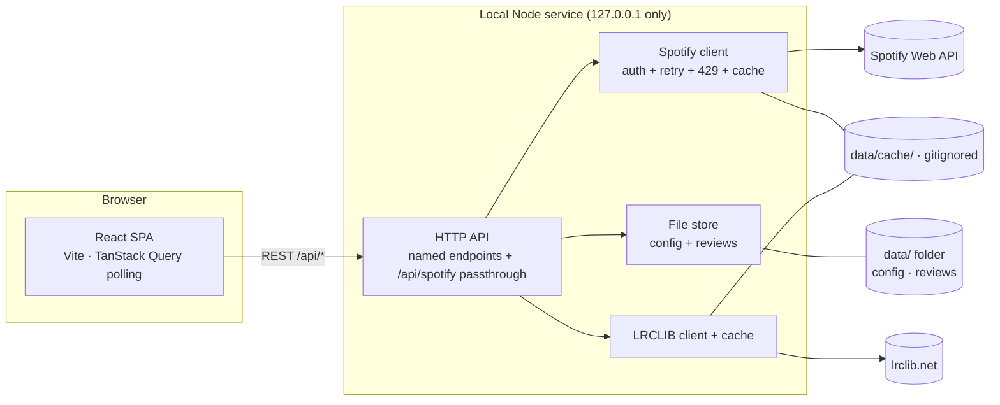

# Architecture

Status: **proposal** — pairs with `functional-spec.md` v0.6
Date: 2026-08-27

This is the recommended architecture for MVP1. It is deliberately small:
one React app, one stateless Node service, a folder of files for the few
things Spotify won't hold (config + reviews).

**No app-side listening log.** "Recently listened" = Spotify's
`recently-played` (last 50) + the current track. That removes the
background poller, the JSONL log, and the realtime push channel — the
backend is now pure request/response.

---

## 1. Shape at a glance



- The browser **never** sees a Spotify token. Every Spotify call is
  proxied by the Node service, which holds the client secret and the
  refresh token.
- The Node service is the only thing that touches the filesystem.
- `data/config/` and `data/reviews/` are committed to git; that is the
  whole "database". `data/cache/` and `data/.auth.json` are gitignored.
- No background process. The frontend polls `/api/playback` (~3 s) and
  `/api/recent` (~15 s) via TanStack Query `refetchInterval`.

---

## 2. Repo layout

```
spotify/
  package.json            # npm workspaces root — scripts: dev, build, start
  tsconfig.base.json
  .env                    # SPOTIFY_CLIENT_ID / _SECRET / redirect / web origin  (gitignored)
  .env.example
  .gitignore
  docs/
  packages/
    shared/               # Zod schemas + TS types: config files, API DTOs
    server/               # Node + Fastify + TypeScript
      src/
        index.ts          # boot: load config, listen on 127.0.0.1:8888
        auth/             # OAuth Authorization-Code flow + token store
        spotify/          # authed fetch wrapper (refresh on 401, respect 429), typed helpers, GET cache
        lyrics/           # LRCLIB get/search + on-disk cache
        store/            # typed read/write for config, backlog, revisit, reviews
        routes/           # /api/* handlers + /api/spotify passthrough
    web/                  # React + Vite + TypeScript
      src/
        api/              # typed client for the backend
        features/
          now-playing/    # big Like button, transport, progress
          recent/         # recently-listened rows w/ inline Like + Banger
          backlog/        # album list, "play album"
          album/          # tracklist + metadata + lyrics
          review/         # verdict buttons + notes form
          settings/       # banger playlist picker, device, auth
        components/
        store/            # small Zustand store for UI-only state
  data/
    config/
      settings.json       # preferredDeviceId
      buttons.json        # banger button config (see §6)
      backlog.json        # ordered album list
      revisit.json        # revisit list -> review pointers
    reviews/
      2026/               # <artist-slug>-<album-slug>.md, frontmatter + notes
    cache/                # gitignored — lyrics + spotify GET responses
    .auth.json            # gitignored — refresh token
```

`.gitignore`: `node_modules`, `dist`, `.env`, `data/cache/`, `data/.auth.json`

**Why a monorepo:** `packages/shared` holds one set of Zod schemas both
sides import, so the config-file shapes and the API request/response types
can't drift.

**Package manager:** npm workspaces (npm 10, ships with Node 22 — no extra
install). pnpm would also be fine but isn't available in this environment.

---

## 3. Processes & how it runs

| Mode | Command | What happens |
|---|---|---|
| Dev | `npm run dev` | `concurrently` runs `tsx watch` on the server (`:8888`) and Vite (`:5173`). Vite proxies `/api`, `/auth`, `/callback` → `:8888`. Open `http://127.0.0.1:5173`. |
| Local "real" use | `npm run build && npm start` | Vite builds static assets; Fastify serves `packages/web/dist` **and** the API on `:8888`. Open `http://127.0.0.1:8888`. |

Single-user, single-machine: no login page, no cookies/JWT. The server
binds to `127.0.0.1` only and that is the whole security model for MVP1.

---

## 4. Auth flow (Authorization Code)

1. Spotify dashboard: register an app, add redirect URI
   `http://127.0.0.1:8888/callback` (Spotify allows plain HTTP only
   for loopback IP literals — use `127.0.0.1`, not `localhost`).
2. `.env`: `SPOTIFY_CLIENT_ID`, `SPOTIFY_CLIENT_SECRET`,
   `SPOTIFY_REDIRECT_URI`, `WEB_ORIGIN` (where to bounce the browser
   after auth — `:5173` in dev, `:8888` in prod).
3. `GET /auth/login` → 302 to Spotify authorize URL (scopes from spec
   FR-1, random `state`).
4. `GET /callback?code&state` → server exchanges `code` + secret for
   tokens, writes the **refresh token** to `data/.auth.json`, keeps the
   access token in memory, 302s to `WEB_ORIGIN`.
5. `spotify/` wrapper refreshes the access token on expiry or on a 401
   (once), transparently.
6. `GET /api/auth/status` → `{ connected, scopes, expiresAt }` for the
   Settings screen.

---

## 5. The Spotify client wrapper

One chokepoint (`packages/server/src/spotify/`) so resilience lives in a
single place:

- injects `Authorization: Bearer …`
- on `401` → refresh once, retry
- on `429` → wait `Retry-After`, retry (bounded)
- small concurrency cap (e.g. 4) to stay under the rolling 30 s window
- on-disk cache for immutable GETs (album, track, playlist snapshots) in
  `data/cache/spotify/`; short TTL memo for `recently-played`

Typed helpers: `getPlayback()`, `getRecentlyPlayed()`, `play(context)`,
`pause()`, `next()`, `previous()`, `seek(ms)`, `getDevices()`,
`isTrackSaved(ids[])`, `saveTrack(id)`, `removeSavedTrack(id)`,
`playlistContains(pid, ids[])`, `addToPlaylist(pid, uri)`,
`saveAlbum(id)`, `removeSavedAlbum(id)`, `getAlbum(id)`,
`getMyPlaylists()`.

---

## 6. Data file formats

**`config/buttons.json`** (MVP1 — single banger button):

```json
{
  "banger": {
    "label": "Banger",
    "playlistId": "2HV7vgCtRds2I5veOv4j72",
    "autoLike": true,
    "shortcut": "b"
  }
}
```

Placeholder playlist:
`https://open.spotify.com/playlist/2HV7vgCtRds2I5veOv4j72`. The user sets
the real one via the Settings screen. MVP2 turns this key into an array
of button defs.

**`config/backlog.json`**

```json
{
  "items": [
    { "albumId": "3Aht...", "uri": "spotify:album:3Aht...",
      "addedAt": "2026-08-27", "priority": 0 }
  ]
}
```

**`config/revisit.json`**

```json
{
  "items": [
    { "albumId": "3Aht...", "reviewPath": "reviews/2026/deafheaven-sunbather.md",
      "addedAt": "2026-08-27" }
  ]
}
```

**`config/settings.json`**

```json
{ "preferredDeviceId": null }
```

**`reviews/2026/<artist>-<album>.md`**

```markdown
---
album: "Sunbather"
artist: "Deafheaven"
albumId: "3Aht..."
verdict: keep          # keep | revisit | pass | delete
rating: 8              # 1-10, optional
tags: [blackgaze]
listenedOn: 2026-08-27
revisitedOn: []
---

Free-text notes.
```

`.auth.json` (gitignored): `{ "refreshToken": "...", "scope": "...", "obtainedAt": "..." }`

---

## 7. Recently listened & "already routed" state

No recording. The Recently-listened view is built live:

1. `GET /api/recent` → server calls Spotify `recently-played` (last 50),
   prepends the currently-playing track, dedupes.
2. For the tracks in view, the server also resolves triage state in two
   batched calls:
   - `GET /me/tracks/contains?ids=…` (50 max) → which are Liked
   - `playlistContains(bangerPlaylistId, ids)` — snapshot-cached; a full
     fetch of the banger playlist's track ids, refreshed on its
     `snapshot_id` change
3. Response rows: `{ track, playedAt, liked, inBanger }`.
4. Frontend refetches `/api/recent` every ~15 s and after any Like /
   Banger mutation (optimistic update first).

Accepted limitations (from the spec): history stops at 50 tracks, no
completion %, no cross-session stats.

---

## 8. HTTP API

Named endpoints (the app's vocabulary):

| Method | Path | Purpose |
|---|---|---|
| GET | `/api/playback` | current track + device + progress + is_playing |
| GET | `/api/recent` | recently-played (50) + current, each with `liked` / `inBanger` |
| GET | `/api/devices` | Connect targets |
| POST | `/api/playback/{play,pause,next,previous,seek}` | control the selected device |
| POST | `/api/like` `{trackId}` / DELETE `/api/like` `{trackId}` | save / unsave track |
| POST | `/api/banger` `{trackId}` | add to configured playlist **+ auto-Like** (idempotent — checks membership first) |
| GET | `/api/album/:id` | Spotify metadata + tracklist + LRCLIB lyrics, merged |
| GET | `/api/playlists` | the user's playlists (for the Settings picker) |
| GET/POST/DELETE | `/api/backlog` | list / add / remove albums |
| POST | `/api/verdict` `{albumId, verdict, review}` | Spotify side-effects + write review file + update backlog/revisit |
| GET | `/api/reviews`, `/api/review/:albumId` | list / read reviews |
| GET | `/api/revisit` | the revisit list + resolved prior reviews |
| GET/PUT | `/api/config/:name` | read / write a config file (validated by shared Zod schema) |
| GET | `/api/auth/status` | connection state for Settings |

Generic passthrough (for MVP2 custom-command buttons):

| Method | Path | Body |
|---|---|---|
| POST | `/api/spotify` | `{ method, path, query?, body? }` |

Guards: `path` must start with `/v1/`, host is forced to
`api.spotify.com`, method allowlist (`GET/PUT/POST/DELETE`), same retry /
429 handling as §5. A custom button in `buttons.json` is just a saved
payload for this endpoint.

**No realtime channel.** Server→client freshness comes from TanStack
Query polling (`/api/playback` ~3 s, `/api/recent` ~15 s). Mutations do
optimistic updates and invalidate the relevant queries. If a live
now-playing feed ever feels necessary, add one SSE route later — nothing
else changes.

---

## 9. Frontend

- **React 18 + Vite + TypeScript.**
- **TanStack Query** for all server state — caching, `refetchInterval`
  for `/api/playback` and `/api/recent`, mutations with optimistic
  updates + `invalidateQueries`.
- **Zustand** for UI-only state (selected recent row, modal open, …).
- **React Router** — routes: `/` (now-playing + recently listened),
  `/backlog`, `/album/:id`, `/revisit`, `/settings`.
- **Tailwind** for fast, legible big-button layout (swap if you prefer).
- Keyboard: a global handler maps `L` → Like current, `b` → Banger
  current, `space`/arrows → transport; recent rows get focusable Like /
  Banger controls.

---

## 10. Tooling

- **npm** workspaces · **tsx** for the dev server · **concurrently** for
  `npm run dev`
- **Zod** shared schemas · **Vitest** for unit tests (store round-trips,
  verdict side-effects, "already routed" resolution) · **ESLint +
  Prettier**
- Node 20+ (native `fetch`)

---

## 11. What this buys us for later MVPs

- **MVP2 buttons:** `buttons.json` → array; each entry either a playlist
  route or a `/api/spotify` payload. No backend shape change.
- **Stream Deck / MIDI:** a tiny separate script that POSTs the same
  named endpoints. No app change.
- **Own listening log (if ever wanted):** add a poller module + a
  `store/log` writer + one SSE route. The rest is untouched.
- **Permanent store:** the `store/` module is the only filesystem
  boundary — swap it for SQLite or a remote API without touching routes.
- **Multi-device:** put the Node service on a home server, add a single
  shared token; the SPA already assumes a remote backend.

---

## 12. Open choices (low stakes)

- Fastify vs Hono for the server — Fastify recommended (mature, great
  static-serving + validation plugins); Hono if you want it leaner.
- Tailwind vs CSS Modules vs Panda — cosmetic.
- `reviews/index.json` derived cache vs glob-and-parse on demand — start
  with glob-and-parse (fine for hundreds of files).
- Rating scale — proposing 1–10, optional.
